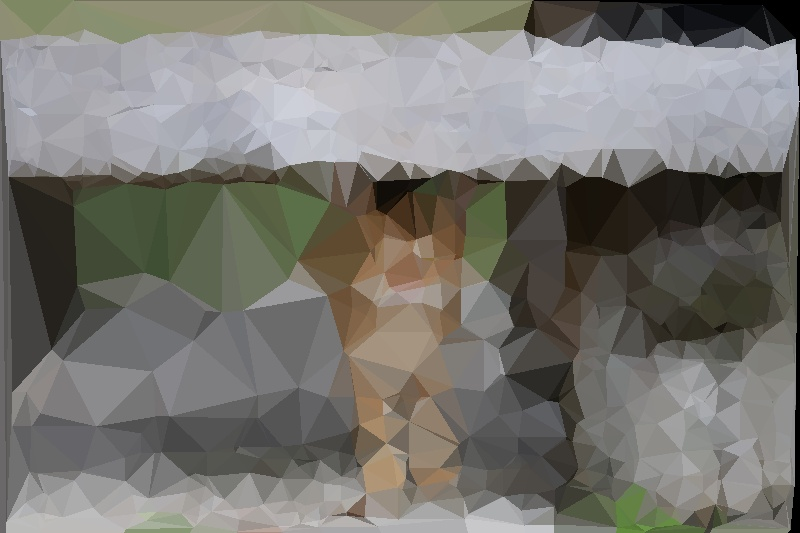
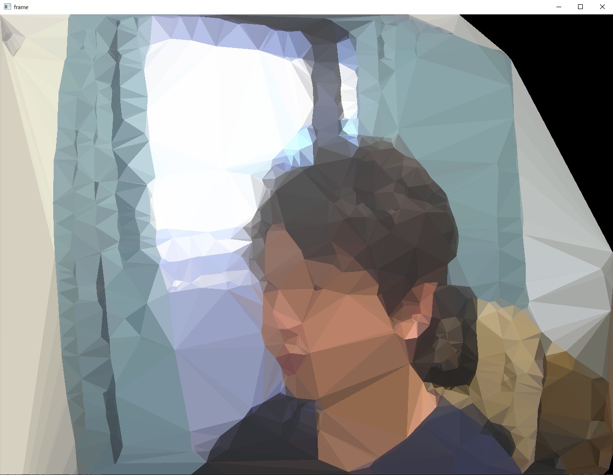

# python_image2tripolygon

## Overview
入力画像を三角ポリゴン化するプログラム。

| 元画像 | 変換画像 |
| :---: | :---: |
|  |  |

[](https://www.youtube.com/watch?v=Oq9Vy0DEZwg)

## Environment
- Windows 10 Home
- pyenv
  - Python3.11.3

## Usage

### 環境構築
```bash
pyenv local 3.10.9
python -m venv venv
venv/Script/activate
(venv)pip install -r requirements.txt
```

### コードの使い方
```python
import cv2
from polygonize import Polygonize

image = cv2.imread("./pic/shikunIMG_9107_TP_V4.jpg")

# インスタンスの初期化
polygonizer = Polygonize()
# 三角点を取得
triangle_samples = polygonizer.polygonize(
    img, args.max_point_num,
    threshold=args.threshold
)
# 画像を三角ポリゴン化する
ret_img = polygonizer.render(img, triangle_samples)

# 画像を保存する
cv2.imwrite(args.output, ret_img)

```

### 画像変換サンプルプログラム実行
```bash
# 画像を変換するサンプル
(venv)python example.py {画像のパス} --output {結果ファイルのパス}
(venv)python example.py -h
usage: example.py [-h] [--max_point_num MAX_POINT_NUM] [--threshold THRESHOLD] [--output OUTPUT] image

positional arguments:
  image                 画像のファイルパス

options:
  -h, --help            show this help message and exit
  --max_point_num MAX_POINT_NUM
                        サンプル点の最大数 (default. 1000)
  --threshold THRESHOLD
                        サンプル点を取得するための重みの閾値 (default. 0.02)
  --output OUTPUT       出力画像のファイルパス (default. result.jpg)
```
### カメラ映像変換サンプルプログラム実行
```bash
# カメラ映像を変換するサンプル
(venv)python example_cam.py
(venv)python example_cam.py -h
usage: example_cam.py [-h] [--video VIDEO] [--max_point_num MAX_POINT_NUM] [--threshold THRESHOLD]

options:
  -h, --help            show this help message and exit
  --video VIDEO         カメラデバイスID
  --max_point_num MAX_POINT_NUM
                        サンプル点の最大数 (default. 1000)
  --threshold THRESHOLD
                        サンプル点を取得するための重みの閾値 (default. 0.02)
```

## Reference
[pmaldonado/PyTri](https://github.com/pmaldonado/PyTri)を参考にさせていただきました。

## License
サンプルで表示している画像は[フリー素材ぱくたそ](https://www.pakutaso.com/)様からお借りしています。

## Author
[T-Sumida](https://twitter.com/sumita_v09)